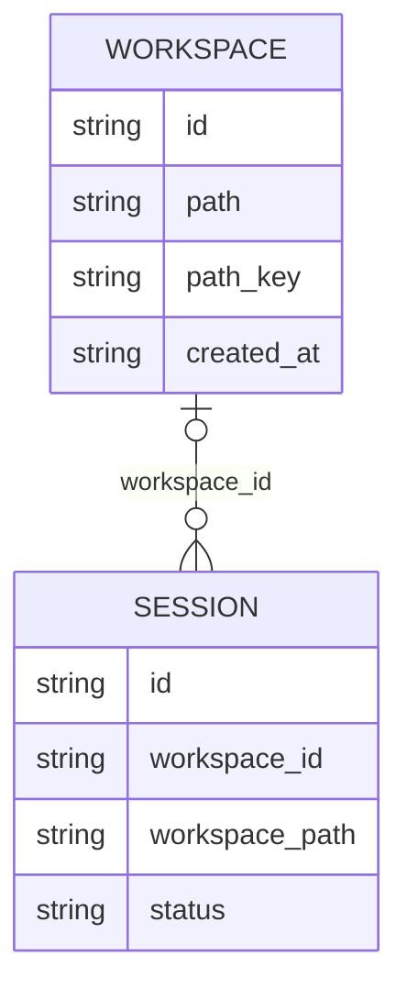

# ADR-0002：工作区与会话侧边栏分组

- 状态：已实施
- 日期：2026-08-08
- 相关文档：`docs/工具与工作区权限方案.md`、`docs/术语表.md`

## 背景

当前侧边栏按“活跃 / 归档”展示全部会话。每个会话都持久化 `Sessions.workspacePath`：新会话未选择路径时，后端会在应用数据目录下为该会话创建独立的默认工作区；选择自定义路径时，后端保存规范化后的真实绝对路径。会话创建后不能修改工作区。

目标侧边栏需要改为两个主要区域：

1. “任务”展示使用默认工作区的会话。
2. “工作区”展示保存的自定义工作区，并在每个工作区下展示最终选择该路径的会话。

用户既可以从全局入口新建会话，也可以从某个工作区下新建会话。工作区入口只负责预填路径，实际归属以提交首条消息时最终选择的工作区路径为准。

## 已确认决策

### D1：自定义路径自动新增或复用工作区记录

新会话最终选择自定义工作区路径时，系统必须自动新增或复用对应的保存工作区记录，不要求用户预先从侧边栏手动添加。

- 后端先沿用现有规则，将用户选择转换为存在目录的真实绝对路径。
- 保存工作区按规范化后的真实绝对路径识别，同一路径只保存一条记录。
- 已有相同路径的保存工作区时直接复用，不重复新增。
- 从工作区下点击“新建会话”只预填该工作区路径；用户改选其他路径后，会话归入最终路径对应的保存工作区。
- 未选择自定义路径时，继续创建当前的会话独立默认工作区，并将会话展示在“任务”区域。

### D2：工作区名称取末级文件夹名并允许重名

保存工作区名称始终取真实绝对路径的末级文件夹名，不提供独立的可编辑名称。不同路径的末级文件夹名相同时，侧边栏允许出现重名工作区。

- 完整真实路径仍是工作区的唯一身份，不使用显示名称参与去重或关联。
- 工作区行需要展示父路径作为辅助信息；空间不足时可以截断，但必须通过悬停提示保留完整路径。
- 同名工作区的任何操作都必须使用工作区 ID 或完整路径定位，不能使用显示名称定位。

### D3：会话持久化可空的工作区关联

`mboo_sessions` 新增可空的 `workspace_id`，显式表示侧边栏归属，同时继续保留现有 `workspace_path`。

- `workspace_id` 为空：会话使用系统生成的默认工作区，展示在“任务”区域。
- `workspace_id` 非空：会话归属该保存工作区，展示在对应工作区下。
- `workspace_path` 继续保存会话创建时确定的真实绝对路径快照，供现有文件工具权限、命令工作目录和会话详情直接使用。
- 保存工作区路径创建后不可修改，避免保存工作区路径与会话路径快照产生分歧。
- 新会话提交首条消息时，在创建会话和新增或复用保存工作区的同一事务中写入 `workspace_id` 与 `workspace_path`。
- 列表分组使用 `workspace_id`，不得在每次查询时通过路径字符串临时推断归属。

### D4：手动新增后立即保存空工作区

侧边栏“工作区”标题旁提供新增入口，点击后复用现有系统目录选择器。用户成功选择目录后立即新增或复用保存工作区，不以创建会话作为保存前提。

- 新路径在校验和规范化成功后立即落库，并在侧边栏展示空工作区。
- 已存在的路径不重复新增；前端展开并定位已有工作区。
- 用户取消目录选择时不写入记录，也不显示错误。
- 空工作区保留“新建会话”入口，新会话表单默认预填该工作区路径。
- 手动新增与创建会话时的自动新增必须复用同一套路径规范化和新增或复用逻辑。

### D5：删除工作区时级联永久删除下属会话

保存工作区支持删除。删除不是隐藏或解除关联，而是同时永久删除该工作区下的全部活跃和归档会话。

- 删除前必须显示高风险确认提示，明确说明将同时删除下属会话且不可恢复。
- 确认信息应包含工作区名称、完整路径和待删除会话数量，避免同名工作区误操作。
- 用户确认后，删除所有 `workspace_id` 指向该工作区的会话，包括会话数据库记录、ChatMemory、JSONL 事件日志和工具结果制品，再删除工作区记录。
- 不把下属会话改归“任务”，也不保留失去归属的会话。
- 删除工作区记录和会话数据时，绝不删除保存工作区指向的用户磁盘目录及其中任何文件。
- 空工作区删除时仍需确认，但会话数量明确显示为 0。

### D6：存在运行中会话时整体拒绝删除

工作区任一下属会话正在生成、执行工具或等待授权时，工作区删除请求必须整体失败，并要求用户先停止相关会话。

- 以后端删除事务开始前读取的 `active_turn_id` 为最终判断依据，前端状态只用于提前提示或禁用。
- 不自动取消运行中会话，不在取消与永久删除之间制造并发竞争。
- 任一下属会话处于运行中时，不删除任何会话、会话制品或工作区记录。
- 用户停止全部运行中会话后，需要重新发起并确认删除。
- 后端错误信息应明确指出存在运行中会话；前端刷新会话与工作区状态后保留工作区。

### D7：活跃与归档页签使用相同分组层级

保留现有侧边栏顶部“活跃 / 归档”切换。在两个页签内，会话都按“任务 / 工作区”分组，不再使用单一的扁平会话列表。

活跃页：

- “任务”展示 `workspace_id` 为空的活跃会话。
- “工作区”展示全部保存工作区，包括尚无活跃会话的空工作区。
- 每个工作区下只展示该工作区的活跃会话，并提供“新建会话”入口。

归档页：

- “任务”展示 `workspace_id` 为空的归档会话。
- “工作区”只展示至少包含一个归档会话的保存工作区。
- 每个工作区下只展示该工作区的归档会话，不提供新增工作区或新建会话入口。

取消归档后，会话按持久化的原 `workspace_id` 返回活跃页对应分组；默认工作区会话仍返回“任务”。

### D8：分组与工作区折叠状态在前端持久化

“任务”“工作区”和每个工作区都支持独立折叠，初次使用时默认展开。折叠属于当前浏览器的界面偏好，不写入后端数据库。

- “任务（n）”统计当前页签下的默认工作区会话数。
- “工作区（n）”统计当前页签下可见的保存工作区数。
- 每个工作区名称后展示当前页签下的会话数。
- 折叠状态按稳定分组键保存到浏览器本地；工作区使用工作区 ID，不能使用可能重名或变化的显示名称。
- 打开会话时自动展开“任务”或对应工作区，但不自动折叠其他分组。
- 新增工作区或选择了已存在的工作区后，自动切到活跃页、展开“工作区”和目标工作区，并滚动定位。
- 删除工作区后同时清理该工作区对应的本地折叠状态。

### D9：历史会话按默认目录结构幂等回填

已有数据库中的会话没有 `workspace_id`。升级时通过轻量启动迁移回填工作区归属，迁移重复执行不得创建重复记录或改写已经建立的关联。

- `workspace_path` 符合系统默认目录结构 `.../workspaces/yyyy-MM-dd/{sessionId}` 时，保留 `workspace_id` 为空并归入“任务”。
- 其他能够解析的历史 `workspace_path` 视为自定义路径，新增或复用保存工作区并回填 `workspace_id`。
- 历史路径已不存在、格式非法或无法解析时，不阻止应用启动；保留 `workspace_id` 为空，暂时归入“任务”，并记录包含会话 ID 和原因的中文警告日志。
- 历史自定义路径恰好符合系统默认目录结构时会被识别为默认工作区；接受这一低概率迁移歧义。
- 迁移只负责历史数据分类，不创建、移动或删除任何磁盘目录。
- 新库由 `schema.sql` 直接创建完整结构；旧库继续沿用当前 `PRAGMA table_info` + `ALTER TABLE` 风格的轻量迁移，并补充工作区表创建和数据回填。

### D10：路径失效不改变保存工作区及会话归属

保存工作区创建后，磁盘目录被移动、改名、删除或暂时不可访问时，不自动删除工作区记录，也不修改下属会话的 `workspace_id`。

- 工作区和下属会话继续按原关系展示，工作区行标记“路径不可用”并保留原完整路径。
- 历史会话仍可打开和查看；会话内依赖工作区的工具继续沿用现有路径校验并返回具体错误。
- 路径不可用时禁用该工作区下的“新建会话”入口，因为新会话工作区必须是当前存在的目录。
- 保存工作区路径不可修改。目录迁移后，用户通过“新增工作区”选择新路径，得到新的保存工作区。
- 原路径恢复可用后，刷新工作区列表即可恢复正常状态，不需要数据库修复。
- 删除路径不可用的工作区仍只清理应用内工作区和会话数据，不尝试删除或修复磁盘目录。

### D11：工作区入口只预填尚未创建会话的路径

从保存工作区下点击“新建会话”时，复用现有的新会话编辑态，不立即创建数据库会话，只把该工作区路径预填为待提交路径。

- 用户通过现有目录选择器改选其他自定义路径，也可以清除选择并改用默认工作区。
- 提交首条消息时才创建会话，并以此刻最终选择为准写入 `workspace_id` 和 `workspace_path`。
- 最终为空时创建会话独立默认工作区并归入“任务”；最终为自定义路径时新增或复用对应保存工作区并归入该工作区。
- 用户在发送首条消息前退出或切换会话时，不产生空会话或额外工作区记录。

### D12：工作区稳定排序，会话按时间倒序

- 工作区按末级文件夹名升序排列；名称相同时再按完整路径升序排列。
- 活跃页“任务”和各工作区下的会话按 `updated_at` 倒序排列。
- 归档页“任务”和各工作区下的会话按 `archived_at` 倒序排列。
- 当前选中的工作区和会话保持原排序位置，只进行高亮、自动展开和必要的滚动定位，不强行置顶。
- 路径不可用状态和工作区是否为空都不改变工作区排序规则。

### D13：侧边栏不提供搜索

新的“任务 / 工作区”侧边栏不保留现有会话搜索框，也不新增工作区搜索或过滤能力。

- 删除当前前端的搜索输入、`sessionQuery` 状态及对应过滤逻辑。
- 会话和工作区始终按 D12 的完整排序结果展示。
- 折叠是控制长列表密度的主要手段，不引入搜索态下的临时展开规则。

### D14：工作区只在创建会话前可改

工作区路径只允许在新会话发送首条消息之前修改。会话创建后，`workspace_id` 和 `workspace_path` 均不可修改。

- 已创建会话不支持从“任务”迁入保存工作区。
- 已创建会话不支持从保存工作区迁入“任务”或其他保存工作区。
- 归档和取消归档不改变工作区归属。
- 不提供修改已有会话工作区的后端接口或前端操作。
- 不可变工作区保证会话权限、相对路径解析、命令工作目录和历史工具记录始终基于同一目录。

## 待确认决策

- 无。

## 备选方案

| 备选 | 结论 | 原因 |
| --- | --- | --- |
| 仅允许会话选择已手动添加的工作区 | 否决 | 会限制新会话修改路径的现有能力，也不符合“以最终选择路径决定归属” |
| 自定义路径未保存时作为未分组会话展示 | 否决 | 用户已确认自定义路径应自动新增或复用工作区记录 |
| 工作区名称必须唯一 | 否决 | 名称只反映末级文件夹名；唯一性由真实绝对路径保证，同名时通过父路径区分 |
| 增加可编辑的工作区别名 | 否决 | 当前需求已明确名称取末级文件夹名，不额外引入命名和改名状态 |
| 仅通过 `Sessions.workspacePath` 与工作区路径动态匹配 | 否决 | 无法直接表达默认工作区来源，列表查询还会重复承担路径归一化和关联推断 |
| 只有创建首个会话后才保存工作区 | 否决 | 手动新增的工作区需要立即成为可见、可用于新建会话的独立入口 |
| 删除工作区时只删除工作区记录 | 否决 | 用户要求删除工作区时同时永久删除下属会话，不产生孤立归属 |
| 删除工作区时同时删除用户磁盘目录 | 否决 | 工作区删除只清理应用内记录与会话制品，不触碰用户项目目录 |
| 删除工作区时自动停止运行中会话 | 否决 | 取消与永久删除并发可能产生新的事件或制品；应先完成停止，再单独执行删除 |
| 移除“活跃 / 归档”切换，只在新分组中展示活跃会话 | 否决 | 会削弱现有归档会话的发现与恢复能力，两个页签复用相同分组更一致 |
| 将所有历史会话统一归入“任务” | 否决 | 会丢失已有自定义路径会话的项目分组信息 |
| 历史路径异常时中止应用启动 | 否决 | 单条历史数据异常不应阻断整个应用；保留会话并记录警告更利于恢复 |
| 在新分组中保留或扩展搜索 | 否决 | 用户明确本次侧边栏不提供搜索 |
| 允许创建后移动会话 | 否决 | 会改变会话权限和相对路径语义，并使历史工具记录失去稳定的工作目录基准 |

## 领域模型



- 保存工作区是自定义真实路径的持久化身份，独立于会话存在。
- 会话至多归属一个保存工作区；不归属保存工作区的会话属于“任务”。
- `Workspace.available` 是读取时根据磁盘状态计算的展示状态，不持久化。
- 工作区名称由 `path` 的末级文件夹名派生；根目录没有末级名称时使用完整根路径作为显示名称。
- 工作区不存在“重命名”“修改路径”“归档”状态，只有存在与删除两种生命周期事实。

## 数据库设计

### 保存工作区表

```sql
CREATE TABLE IF NOT EXISTS mboo_workspaces (
    id TEXT PRIMARY KEY,
    path TEXT NOT NULL,
    path_key TEXT NOT NULL,
    created_at TEXT NOT NULL
);

CREATE UNIQUE INDEX IF NOT EXISTS idx_workspaces_path_key
    ON mboo_workspaces(path_key);
```

字段说明：

| 字段 | 含义 |
| --- | --- |
| `id` | 保存工作区 ID，由 MyBatis-Plus 分配 |
| `path` | 创建时解析得到的真实绝对路径，创建后不可修改 |
| `path_key` | 跨请求稳定的路径比较键，用于唯一约束，不直接展示 |
| `created_at` | 工作区首次保存时间 |

`path_key` 不能直接等同于用户输入字符串：

- 所有平台先对存在的目录执行绝对化、规范化和 `toRealPath()`。
- Windows 使用真实路径的小写形式生成比较键，大小写转换使用 `Locale.ROOT`。
- Unix-like 系统保留路径大小写。
- 比较键增加平台前缀，避免数据库被迁移到不同路径语义的平台后发生静默碰撞。
- “先查询再插入”仍可能并发冲突；插入命中唯一约束时重新按 `path_key` 查询并返回已有记录。

### 会话表调整

```sql
ALTER TABLE mboo_sessions ADD COLUMN workspace_id TEXT;

CREATE INDEX IF NOT EXISTS idx_sessions_workspace_status
    ON mboo_sessions(workspace_id, status, updated_at DESC);

CREATE INDEX IF NOT EXISTS idx_sessions_workspace_archived
    ON mboo_sessions(workspace_id, status, archived_at DESC);
```

- 新库直接在 `mboo_sessions` 建表语句中包含 `workspace_id`。
- 旧库启动时先通过 `PRAGMA table_info(mboo_sessions)` 判断列是否存在，再执行 `ALTER TABLE`。
- 不在 SQLite 声明物理外键：现有旧库无法通过简单追加列获得同等外键约束，且工作区删除需要先做运行中检查和应用制品清理。关联完整性由服务层和删除事务保证。
- `Sessions` 增加带 Swagger 注解的 `workspaceId` 字段；现有 `workspacePath` 语义不变。

## 历史迁移

新增独立的工作区结构迁移组件，执行顺序为：

1. 创建 `mboo_workspaces` 和唯一索引。
2. 为旧 `mboo_sessions` 补充 `workspace_id` 和分组索引。
3. 查询 `workspace_id IS NULL` 的既有会话。
4. 按 D9 识别系统默认目录；命中时不回填。
5. 对其他仍存在的目录执行真实路径解析，新增或复用保存工作区并回填会话。
6. 每条历史会话使用独立的小事务回填；单条路径异常只记录警告并继续，不回滚已经成功处理的其他会话。

默认目录识别必须同时满足：路径末三级为 `workspaces/{yyyy-MM-dd}/{sessionId}`、日期可解析、末级目录与当前会话 ID 完全一致。迁移只更新 `workspace_id`，不改写历史 `workspace_path`。

## 后端接口

### 工作区接口

| 方法 | 路径 | 请求 / 响应 | 说明 |
| --- | --- | --- | --- |
| `GET` | `/workspace/list` | `List<WorkspaceResp>` | 返回全部保存工作区，包含派生名称和可用状态 |
| `POST` | `/workspace` | `WorkspaceCreateReq -> WorkspaceResp` | 按路径新增或复用工作区，重复路径返回已有记录 |
| `DELETE` | `/workspace/{workspaceId}` | `WorkspaceDeleteResp` | 确认动作之后调用，级联永久删除下属会话 |

`WorkspaceResp` 至少包含：

```text
id, name, path, available, createdAt
```

`WorkspaceDeleteResp` 返回实际删除的会话数量，便于前端刷新后核对结果。工作区不存在、路径参数非法、路径不是目录、路径无法解析、存在运行中会话分别返回明确的中文业务错误。

### 现有接口调整

- `GET /session/list` 与 `GET /session/list/archived` 的 `Sessions` 响应自然增加 `workspaceId`。
- `POST /session/chat` 请求结构不新增字段，继续以新会话的 `workspacePath` 为输入；后端根据最终路径新增或复用工作区并写入关联。
- 现有 `POST /config/selectDirectory` 保持只负责打开目录选择器和返回路径，不直接持久化工作区。
- Next.js 增加 `/api/workspace/list`、`/api/workspace` 和 `/api/workspace/[workspaceId]` 代理路由，继续复用 `proxyBackendJson`。

## 服务流程

### 手动新增工作区

```text
点击新增工作区
  -> POST /api/workspace/select-directory（现有目录选择代理）
  -> 用户取消：结束，不请求保存接口
  -> 返回路径：POST /api/workspace
  -> 后端重新校验并解析真实路径
  -> 按 path_key 新增或复用
  -> 前端刷新、展开并定位返回的工作区 ID
```

目录选择结果不能被当作可信持久化输入；`POST /workspace` 和新会话创建都必须在后端重新检查目录存在性。

### 创建会话

`SessionService.createSession` 调整为：

1. 先构造会话基础字段，但不提前提交不完整会话。
2. `workspacePath` 为空时，创建现有会话独立默认工作区，设置 `workspaceId = null`。
3. `workspacePath` 非空时，调用统一的工作区新增或复用逻辑，设置 `workspaceId = workspace.id`、`workspacePath = workspace.path`。
4. 在同一数据库事务中保存完整会话、工作区关联和事件日志 URI。
5. 返回的首个会话事件携带新 `sessionId`；前端刷新三份列表后按 `workspaceId` 展示。

从某个工作区发起的新会话仍只传路径，不传客户端声明的 `workspaceId`，避免 ID 与路径被组合成不一致请求；最终关联始终由后端通过真实路径决定。

### 删除工作区

删除流程需要保证“运行中则一个也不删”：

1. 按 `workspaceId` 获取进程内分段操作锁，防止当前单进程内新 turn 与删除交叉认领。
2. 在数据库事务中读取工作区及全部下属会话快照。
3. 任一 `active_turn_id` 非空时抛出业务错误，事务不做任何修改。
4. 删除对应 `mboo_chat_memory`，并通过带 `workspace_id` 和 `active_turn_id IS NULL` 条件的语句删除全部会话；实际删除数必须等于快照数，否则回滚并按运行状态冲突处理。
5. 删除工作区记录并提交事务。
6. 使用事务前快照清理每个会话的 JSONL、工具结果制品和内存授权上下文；文件清理失败时重试一次并记录中文错误日志，不得触碰 `Workspace.path` 指向的目录。

`TurnService` 在为自定义工作区会话认领 `active_turn_id` 时使用同一工作区操作锁。当前项目明确按单进程运行；未来支持多进程时需要把该互斥升级为数据库状态或分布式锁。

## 前端设计

### 信息层级

```text
[新会话] [刷新]
[ 活跃 | 归档 ]

v 任务（2）
    会话 A                              1分钟前
    会话 B                              3天前

v 工作区（2）                          [+]
  v mboo-code（2）                 [+] [删除]
      F:\code\project\java
      会话 C                            2小时前
      会话 D                            4天前
  > mboo-web（0）                  [+] [删除]
      F:\code\project\web
```

- 顶部全局“新会话”保留，进入未选择自定义路径的新会话编辑态，默认归入“任务”。
- “工作区”标题使用加号图标新增工作区，并提供可访问名称和悬停提示。
- 活跃页工作区行提供图标形式的“新建会话”和“删除工作区”；触控窄屏保持操作可发现。
- 归档页不显示新增工作区、工作区新建会话和删除工作区操作；需要删除时回到活跃页，那里始终展示全部保存工作区。
- 工作区使用文件夹图标、名称、当前页签会话数、父路径和可用状态。父路径截断时通过 `title` 展示完整路径。
- 会话行复用现有重命名、归档、取消归档和永久删除操作。
- 不使用嵌套卡片；分组、工作区和会话通过缩进、图标和分隔层级表达。

### 前端状态

新增：

- `workspaces: WorkspaceInfo[]`
- `collapsedGroups: Record<string, boolean>`，键使用 `tasks`、`workspaces`、`workspace:{id}`
- `addingWorkspace`、`deletingWorkspaceId` 和工作区级错误状态

移除：

- `sessionQuery`
- 搜索输入及 `visibleSessions` 中的查询过滤、当前会话置顶逻辑

`refreshSessions` 改为并行请求活跃会话、归档会话和全部工作区。分组通过 `workspaceId` 构造：

- 活跃页：全部工作区 + 当前工作区的活跃会话。
- 归档页：只保留拥有归档会话的工作区。
- 关联到前端未知工作区 ID 的会话不静默归入“任务”，显示列表数据异常提示并触发一次整体刷新。

折叠状态写入新的本地存储键，解析失败时回退为全部展开。打开会话、创建工作区或从工作区发起新会话时，只更新必要的折叠键。

### 删除确认

确认文案至少包含：

```text
确认删除工作区“mboo-code”？
路径：F:\code\project\java\mboo-code
将同时永久删除 3 个下属会话，此操作不可恢复。
磁盘中的工作区目录和文件不会被删除。
```

确认期间禁用重复提交。后端返回“存在运行中会话”时，保留全部列表数据、显示“请先停止工作区内正在运行的会话”，并刷新会话状态。

## 错误与边界

| 场景 | 行为 |
| --- | --- |
| 目录选择取消 | 不落库、不显示错误 |
| 重复新增同一路径 | 返回并定位已有工作区 |
| 两个请求并发新增同一路径 | 唯一索引保证一条记录，冲突请求重新查询已有记录 |
| 工作区路径失效 | 保留分组并标记不可用，禁用新建会话 |
| 新会话提交前路径失效 | 创建请求失败，不产生会话，保留用户输入以便重试 |
| 工作区同名 | 显示同名，使用父路径区分，操作只传 ID |
| 删除时存在运行中会话 | 整体拒绝，不清理任何记录或制品 |
| 删除请求重复提交 | 第二次返回“工作区不存在”，前端刷新后收敛为空 |
| 历史自定义路径无法解析 | 暂归“任务”并记录迁移警告，不阻断启动 |

## 实施顺序

1. 新增工作区表、会话关联列、实体、Mapper 和幂等迁移。
2. 新增工作区路径规范化、新增或复用、列表和删除服务。
3. 调整会话创建流程和工作区删除并发保护。
4. 新增后端 Controller、DTO 与 Next.js 代理路由。
5. 调整前端类型、刷新逻辑、新会话预填和分组派生状态。
6. 重构桌面与移动端共用的侧边栏渲染，移除搜索。
7. 更新已实施文档中的会话工作区描述，并将本文状态保持为“已实施”。

项目约定只有用户主动要求时才编写单元测试，本方案不预设新增单元测试文件；实施时仍需按以下验收场景做人工或接口验证。

## 验收场景

1. 全局新建会话不选路径，创建后只出现在“任务”。
2. 手动新增空工作区后立即展示；重复选择同一路径只定位已有工作区。
3. 从工作区 A 新建会话，保持预填路径发送后归入 A。
4. 从工作区 A 新建会话，改选 B 路径发送后归入 B；B 不存在时自动新增。
5. 从工作区 A 新建会话，清除路径发送后归入“任务”。
6. 两个末级文件夹同名的工作区同时展示，父路径和操作目标正确。
7. 活跃、归档、取消归档后会话始终保持原工作区归属。
8. 空工作区在活跃页显示，在归档页不显示；仅有归档会话的工作区在两个页签均按规则出现。
9. 工作区路径失效后显示不可用、不能新建会话，历史会话仍可打开；恢复路径后刷新可用。
10. 工作区内存在运行中或待授权会话时删除整体失败，数据不变。
11. 删除非运行工作区时同时删除全部活跃和归档会话、ChatMemory、JSONL 和工具结果，但保留用户磁盘目录。
12. 折叠状态刷新后恢复，打开选中会话会自动展开正确分组。
13. 旧库升级后，默认目录会话进入“任务”，可解析的自定义路径会话进入自动建立的工作区。

## 影响

- 数据库需要新增保存工作区表，真实绝对路径需要唯一约束。
- `mboo_sessions` 需要新增可空的 `workspace_id`，并保留现有 `workspace_path`。
- 新会话创建流程需要在确认最终路径时新增或复用保存工作区。
- 会话列表接口需要向前端提供足以区分默认工作区与保存工作区归属的数据。
- 前端侧边栏需要从扁平会话列表改为“任务 + 工作区 / 会话”的分组视图。
- 工作区级联删除扩大了现有“只有归档会话可永久删除”的能力边界，必须使用独立服务方法和高风险确认，不能复用单会话删除接口逐个调用。
- 现有工具权限方案不改变：权限仍只读取会话不可变的 `workspacePath`，不依赖工作区表实时路径。
